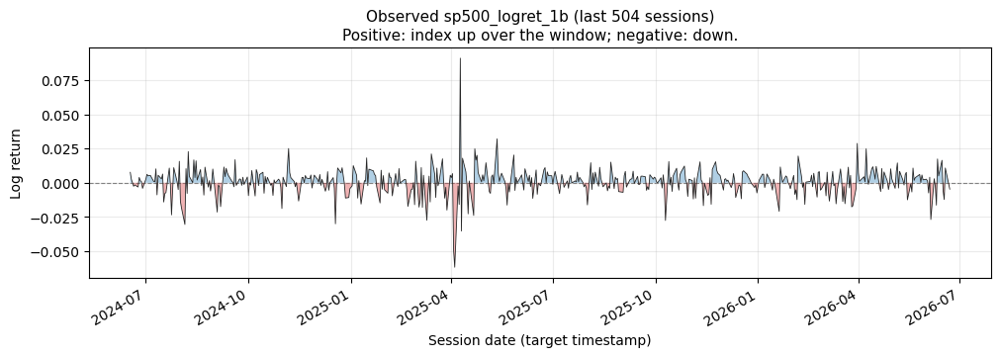
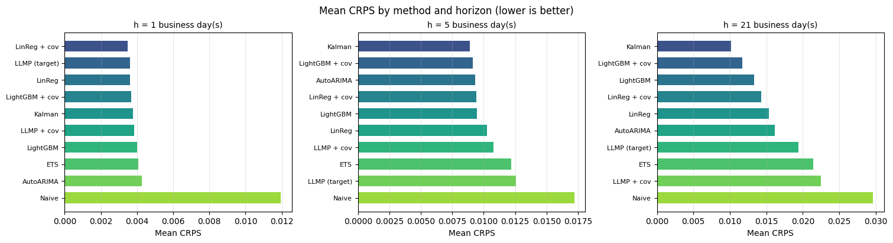
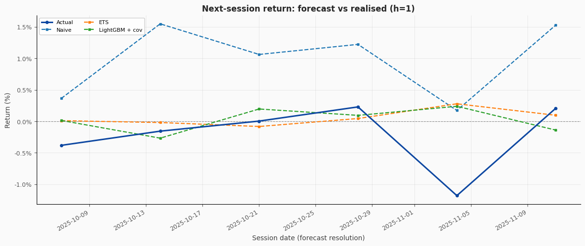
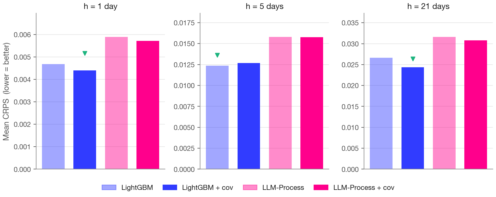

# Conventional methods are hard to beat (S&P 500)

*Draft — pending author review by Behnoosh Zamanlooy.*

**By Ethan Jackson, Behnoosh Zamanlooy, Ali Kore, and Shayaan Mehdi**

Few forecasting problems have a longer paper trail than the stock market. Trying to
model the prices of a basket of companies — the S&P 500 and indices like it — helped
motivate an entire branch of applied mathematics: **mathematical / quantitative
finance**, decades of research aimed squarely at the returns of instruments like this
one. And the stakes are not academic. Retirements are invested in these indices; large
banks spend real money trying to forecast how their returns will move. As Behnoosh
framed it in the lecture, this is a problem serious enough to have grown its own field
of math around it — which makes it a good place to ask a blunt question: with modern
methods and a rich panel of market data, can we actually forecast it?

*Real data — observed next-session (`h=1`) log returns of `^GSPC`, last 504 sessions, from `01_sp500_multivariate_backtest.ipynb`. Blue = up over the window, red = down. This is the target: a near-zero-mean, heavy-tailed series with the occasional violent day.*

That chart is the honest starting point. Day-to-day index returns are close to a
martingale — the level of tomorrow's return is nearly unforecastable, and any
point forecast far out sits near zero. What *is* forecastable, and what actually
matters to a risk desk, is the **spread and the direction**: how wide the distribution
of outcomes is, and which way it leans. So the interesting question is not "what number
comes next" but "how sure can any method honestly be, and does reading the wider market
help it."

## The problem, stated precisely

We forecast **close-to-close cumulative log returns** of the S&P 500 at three horizons,
one series per horizon: **1, 5, and 21 business days** ahead — the overnight return, the
forward week, and the forward month. (For anything past one day it is the *cumulative*
return over the window, not a single day's move.) Working in returns rather than the
index level keeps the target roughly stationary, which is the right footing for a
methods comparison. The three horizons map to three real jobs: next-day risk
management, weekly tactical rebalancing, and monthly allocation.

## A ladder of conventional methods

The point of the exercise is a clean bake-off: put a range of methods on *exactly* the
same task, reading *exactly* the same data, and score them the same way. Behnoosh walked
up a ladder of them, from the humblest to the strongest.

- **Naive.** Predict zero return at every step. It is the floor every other method has
  to clear — the equivalent of "assume nothing changes."
- **AutoARIMA.** The classical autoregressive workhorse: model the next return as a
  function of recent lagged returns and the model's own recent forecast errors. Choosing
  how many lags to keep used to be a hands-on ritual of reading autocorrelation and
  partial-autocorrelation plots; the Darts `AutoARIMA` we wrap does that search
  automatically. (Because returns are already close to stationary, we skip the
  differencing the "I" in ARIMA usually handles.)
- **ETS (exponential smoothing).** Track a slowly moving *level* and forecast the next
  value as an interpolation between that level and the last observation, optionally with
  trend and seasonality.
- **Kalman filter.** Treat the observed price as the surface of an unobserved latent
  state — bull, steady, bear, on a continuum — infer that hidden state from the past, and
  read anything it can't explain as noise.
- **LightGBM (gradient-boosted trees).** The machine-learning entrant. Fit a tree, look
  at where it did badly, fit another tree to those residuals, and repeat. Its great
  virtue is that it eats a mixed bag of covariates with almost no preprocessing — but, as
  Behnoosh was careful to add, *only if you choose the covariates well*.

One theme runs through the first four rungs, and it is one Behnoosh clearly values: the
classical methods are **interpretable**. You can see the lags a model leaned on, the
level it tracked, the state it inferred — and that understanding tells you how to model
better next time. It is easy to treat interpretability as a consolation prize behind
accuracy. On a problem where every method's accuracy is fragile, being able to *see why*
a model said what it said is a first-class feature.

## The covariate panel

The naive, ARIMA, ETS, and Kalman rungs are univariate — they see only the return
history. The regression models (linear regression and LightGBM) can additionally read a
panel of **leak-safe market and macro covariates**, and so can a covariate-fed
LLM-Process (more on that below). Every covariate is lagged by one business day and
carries a conservative release timestamp, so a forecast at a given origin can only ever
see information that genuinely existed then.

| Covariate | What it carries |
|---|---|
| VIX level + VIX log-return | Market-implied volatility (the "fear gauge") |
| 10Y Treasury yield | Long-rate level |
| 2Y–10Y spread | Yield-curve slope (a recession bellwether) |
| Fed funds rate | The policy-rate stance |
| CPI (MoM log-diff) | Inflation surprises |
| Unemployment rate | Labour-market slack |
| Oil log-return | Energy / commodity shocks |
| Gold log-return | Safe-haven demand (skipped if the FRED series is unavailable) |
| Broad dollar index | The currency backdrop |
| NASDAQ log-return | Tech-heavy equity co-movement |

*Source: `implementations/sp500_forecasting/README.md` and the notebook's predictor
config. Exact adapters and transforms live in `data.py`.*

The whole design pairs one method family with one question:

| Family | Predictors | Reads covariates? |
|---|---|---|
| Naive floor | `LastValuePredictor` | — |
| Classical | ETS, Kalman, AutoARIMA | — (univariate) |
| ML regression | Linear regression, **LightGBM** | ✅ optional |
| LLM-Process | Sampled-trajectory LLM forecaster | ✅ optional (covariates serialized into the prompt) |

*Source: `aieng/forecasting/methods/README.md` + the S&P 500 README.*

## How we score it

The main referee is **CRPS**, the continuous ranked probability score we introduced in
[Post 1](../01-forecasting-foundations/post.md). Every method emits not a point but a
distribution — for the classical and ML models, via Monte-Carlo sampling — and CRPS
rewards distributions that are both well-placed and appropriately narrow, punishing a
forecast that is confidently wrong more than one that is honestly wide. Lower is better.

Because CRPS alone doesn't capture whether a desk would have made the right call, we also
track **directional skill**: treat "return up or down" as a classification problem and
measure the area under the ROC curve (AUC). This is most meaningful at the one-day
horizon. It also comes with a sharp reading Behnoosh flagged: an AUC **below 0.5 is worse
than random guessing** — a model that is reliably pointing the wrong way.

Classical methods make the honest-evaluation problem easy here. They are cutoff-safe by
construction — they only ever see the series up to the forecast origin — so they can be
backtested on any historical window, including the 2020 COVID crash we keep as a
numerical-only stress test. The moment an LLM enters, that freedom disappears: with a
training cutoff around January 2025, scoring it on pre-cutoff dates measures memory, not
forecasting. So every LLM-inclusive comparison lives **after** the cutoff — a 2025
backtest to iterate on, a protected 2026 window as the real scoreboard.

## What the bake-off says

*Real backtest — mean CRPS by method and horizon, smoke window (6 weekly post-cutoff origins, late 2025), from `01_sp500_multivariate_backtest.ipynb`. Lower is better. The naive floor is comfortably worst everywhere; the useful spread between the real methods is widest at `h=1` and compresses by `h=21`.*

Three things come through, and they match Behnoosh's read of it.

**Everything beats naive — but not by the same margin at every horizon.** At one day the
naive floor sits far to the right of the pack (roughly 0.012 CRPS versus ~0.0035 for the
leaders), and the covariate-fed regression models top the board. By 21 days the whole
field has compressed toward the naive floor: the extra structure buys less and less as
the horizon grows, exactly as the daily-efficiency story predicts.

**Covariates help at one day and fade after that.** At `h=1` the covariate models lead;
at `h=21` a plain univariate Kalman filter is at or near the top, and adding the panel to
linear regression actually *hurts* relative to the target-only version. As Behnoosh put
it, the covariates seem to capture the market's *shocks* but not its *quiet stretches* —
useful for the next day, a liability once you average over a month.

**Directional skill is genuinely fragile.** On this window several covariate-fed rows
post a directional AUC below 0.5 at `h=1` — worse than a coin flip — while the simpler
classical models hold up better. (These directional numbers come from a short smoke run
of only six origins and are noisy; the qualitative pattern, not the exact value, is the
point. A full-window leaderboard render is on our capture list.) The lesson is not that
covariates are useless; it is that more inputs, badly matched to the horizon, can point a
model confidently the wrong way.

*Real backtest — median `h=1` forecasts vs realised next-session return (percent), smoke window. The realised series is loud; the model forecasts are quiet and near zero. That gap is daily market efficiency made visual — and why the honest object to forecast is the distribution's width, not its center.*

## The headline: a frozen LLM did not beat gradient boosting

The sharpest comparison in this reference is the one that matters most for the rest of
the series. We handed a frozen general-purpose LLM the **same covariate panel** the ML
methods use — serialized as labeled history blocks in its prompt — and ran it as an
LLM-Process forecaster (the method we unpack in [Post 3](../03-llm-processes-cfpr/post.md)),
head-to-head against LightGBM on the full 2025 backtest.

*Real backtest — mean CRPS at each horizon, LightGBM vs LLM-Process (± covariates), across 51 weekly 2025 origins (`data/predictions/sp500_backtest_2025/`). Lower is better; the green marker flags the best per panel. A LightGBM variant wins at every horizon.*

The verdict is honest and it is not the flashy one: **the LLM-Process did not beat
gradient boosting.** At every horizon a LightGBM variant posts the lowest CRPS, and the
gap widens as the horizon grows. At one day the two are close enough to call within the
noise; by a month, LightGBM is clearly ahead. This is exactly the through-line from
Post 1 — *established methods set the bar* — landing on a second dataset. A tuned
tree ensemble with a good covariate panel is, in Behnoosh's words, "sometimes hard to
beat," and on the S&P 500 it was hard to beat here.

We want to be precise about what this does and doesn't show. It is *not* evidence that
LLMs can't forecast; it is evidence that a frozen model, handed the same numeric panel as
a tuned regressor and asked to do the same job, has no special advantage on a
near-efficient series — and every reason to be at a disadvantage. The place an LLM might
earn its keep is where it can read something the covariate columns can't: a headline, a
policy statement, a report. That is the agent story, and it is where the series goes next.

## Classical methods are not something to discard

The takeaway Behnoosh landed on is the one worth carrying forward: the classical models
are "not something to discard." AutoARIMA tracks LightGBM more closely than you'd expect,
the univariate Kalman filter wins outright at the longest horizon, and every one of them
is interpretable, cutoff-safe, and cheap. On a problem this efficient, a simple honest
model is often the right answer.

And that points at the one genuinely open opportunity. The traditional way to squeeze
more out of a shelf of decent-but-imperfect models is to **combine** them — the bagging
and blending that quantitative analysts have long done by hand, weighting and averaging
diverse forecasters into something steadier than any single one. Behnoosh's closing
observation was that this may be precisely the kind of judgment LLMs are good at: reading
a set of diverse expert forecasts and blending them well. We don't settle that here —
but it is a thread we pick up again at the very end of the series, when we look at
self-improving systems and **ensembles of diverse expert forecasters**.

For now the bar is set, twice over. Next in the series, Ali takes up the LLM-Process
properly — a frozen model used as a forecaster, grounded on historical documents — and
puts it to work on Canada's Food Price Report.
