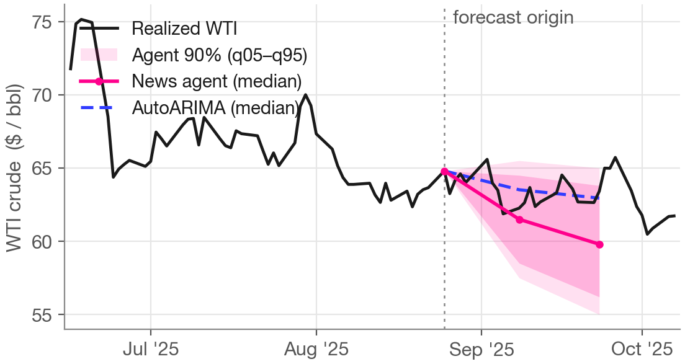

# The Analyst Agent: forecasting with tools, and a leakage problem you can't fully solve

**By Ethan Jackson, Behnoosh Zamanlooy, Ali Kore, and Shayaan Mehdi**

Ask the analyst agent for a two-week WTI crude forecast and it does something an ARIMA
model can't: it runs the numbers, reads the news, and then tells you where it thinks the
numbers are wrong. In one live run during the lecture it came back with a quantile
forecast, a summary of the AutoARIMA baseline it had just computed — and then a verdict:
*we strongly disagree with the ARIMA baseline forecast.* It was flagging unmodeled supply
risk, pointing at a Persian-Gulf situation that was shifting by the day and a WTI price
already trading above what the statistical model expected, and it offered its own adjusted
view with its own interval.

That is the leap this post is about. In [Post 3](../03-llm-processes-cfpr/post.md) an LLM
Process was a static context machine: you pack a series and its supporting documents into
a prompt, and read a forecast back. An agent flips the responsibility. It *sources,
fetches, and computes* — it decides what it needs, goes and gets it, runs code on it, and
only then commits to a number. The same backbone underpins the energy work here and the
Bank of Canada work in [Post 5](../05-evaluating-agents-boc/post.md).

It also creates a problem that a numbers-only model never had, and that we could not fully
solve. This post is the honest version of both halves.

## Still just a `Predictor`

The first thing to say is that nothing about "agent" breaks the evaluation discipline from
[Post 1](../01-forecasting-foundations/post.md). The agent implements the same `Predictor`
interface as everything else — one method, `predict(task, context)`, returning a
probabilistic prediction per horizon. An `AgentConfig` (its identity — instructions, tools,
skills) is wrapped by an `AgentPredictor`, and to the `backtest()` and `evaluate()` harness
that wrapper is indistinguishable from a fifty-year-old ARIMA. The agent doesn't even know
the harness is enforcing a cutoff on its inputs. That is what keeps an agent and a
classical method on the same honest scoreboard.

## Anatomy of the analyst agent

*The analyst agent's components. Every box maps to a real module — `search_web`,
`run_code`, `SkillToolset`, `AgentPredictor`. The dashed slot is where Day 2's adaptive
agent adds a strategy it can rewrite ([Post 6](../06-adaptive-agent/post.md)).*

Underneath the wrapper, the pieces are familiar if you've configured anything in Claude
Code, Codex, or Cursor:

- **An LLM core with a ReAct loop**, built on **Google's Agent Development Kit (ADK)**,
  which gives us the reason → act → observe loop around a Gemini model for free.
- **A news sub-agent for web search.** The `search_web` tool doesn't hit a raw API; it
  calls a sub-agent running **Gemini grounded with Google Search** — Google's own combined
  web-and-news interface. It works nicely and it was the convenient way to get news and web
  search from one source.
- **An E2B code sandbox.** The agent can write and run its own Python in an isolated
  **E2B** sandbox — best practice for agentic code execution when you care about security
  and data privacy — pre-loaded with forecasting packages and able to pull data from
  sources like StatCan.
- **Agent skills**, which we think of as dynamic prompt sections: folders of instructions,
  reference data, and code snippets (`statistical-analysis`, `trend-projection`) the agent
  loads on demand rather than carrying in the system prompt at all times.
- **A Pydantic output schema.** The expected response is a typed class, so a prediction
  task returns a well-formed quantile forecast rather than free text.
- **A local `run_forecast` tool.** Not every tool needs open-ended code generation. This
  one lets the agent press an "AutoARIMA button" and pull a conventional forecast straight
  into its context — a clean pattern for grounding an agent's reasoning in a real model.

## Capabilities are configuration

The useful mental model is a staircase, where each rung just switches on more of that same
anatomy:

1. **No tools.** Core plus price history only. This looks a lot like the LLM Process from
   Post 3 — same data-packing, no fetching. It's the floor.
2. **+ web search.** Now it can react to what a numbers-only model can't see: an OPEC+
   decision, a shipping-lane closure, an escalation in the Gulf.
3. **+ code and skills.** It stops guessing at statistics and computes them — realized
   volatility, a trend fit, a calibrated interval — in the sandbox, guided by the skills.
4. **+ the AutoARIMA tool.** Rigid, auditable, reproducible: a conventional forecast on
   demand.

In the code these are a handful of factory functions differing by a few fields. One
identity, several capability levels — and a genuinely open question, which we kept coming
back to, of *which* tools actually make a forecasting agent more robust rather than just
more elaborate.

*Placeholder — ADK Web live demo. The agent describes its own capabilities, then produces
a 2-week WTI forecast: it runs the ARIMA tool, searches the news on the live Gulf
situation, and returns quantiles plus its adjusted view ("we strongly disagree with the
ARIMA baseline forecast").*

Here is a real backtest forecast from the news agent, so you can see the shape of what it
returns — a reasoned median and a calibrated band, distinct from the statistical
baseline's extrapolation:

*Real 2025 backtest, one origin. The news agent's fan (median + 90% band) against an
AutoARIMA median and the realized series. Not a cherry-picked hero hit — the agent's
edge is a more reasonable interval, not uniformly better point accuracy.*

## A backtest that looked too good

Then we ran the news agent over a 2026 backtest, and the scores were suspicious in a
specific way.

CRPS (lower is better; see [Post 1](../01-forecasting-foundations/post.md)) should get
*worse* as the horizon grows — predicting three weeks out is harder than predicting a few
days out, so uncertainty has to compound. Every honest method in the room does this:
AutoARIMA and the naive baseline both roughly triple their error from 5 to 21 days. The
news agent didn't. It was dead-on at *every* horizon, about the same score at 21 days as
at 5, and it was beating a fifty-year-old statistical method precisely where a legitimate
edge is hardest to find.

*WTI news-agent CRPS by horizon, 2026 eval. Naive and AutoARIMA are unchanged honest
references. Pre-fix (orange, flat ~5.5 across all horizons) versus post-fix (magenta,
fanning out normally): overall CRPS 5.64 → 8.03, about +42% once the leak is plugged.
A forecast whose error doesn't grow with the horizon is a forecast that already knows
how the story ends.*

This wasn't the model being polluted by its training data — it was 2026 data, past the
model's cutoff. It was the *search results* coming back with the eventual outcome in them
when they should have been fenced off. We caught it the way you catch overfitting: a
picture of the errors that looked far too flat and far out of distribution from every
other method. Then, because every run is traced through Langfuse, we opened the actual
tool calls and read what the searches had returned. In one production trace, 11 of the
agent's 14 `search_web` calls had dropped the cutoff argument entirely, and a result came
back with prices dated roughly six weeks *after* the forecast origin. The score raised the
suspicion; the trace confirmed it. (The pre-fix artifacts — the error heatmap and the
too-good forecast plots — are archived at
[`review-inbox/NB04 pre-fix content/`](../../review-inbox/NB04%20pre-fix%20content/forecast%20errors%20heatmap.png).)

We're walking through this plainly because it is not a one-off bug — it is the core tension
of using agents for forecasting, and if you build one of these you will meet it too.

## Two kinds of cutoff

The reason this is hard, and not just a fix-it-and-move-on defect, is that there are two
cutoffs and only one of them is real.

For the **time-series data**, the cutoff is structural. The context object filters every
row by its release date before the agent sees anything, so post-origin data simply isn't
there. The agent *can't* cheat on the numbers; we have machinery in the repo for this and
it's easy.

For the **open web**, there is no such wall. You can ask a search for "what was going on in
oil markets as of January 2026" and hope it censors itself, but that is a very soft
interpretation of a cutoff. As the team put it after trying it: we passed cutoff dates to
the agentic search tools — and to related tools like GDELT and Tavily — and *they just
don't work*. A live web index always knows how the story ends. You can put a fence around
stored data; you cannot structurally fence the open internet.

## Escalating mitigations — less leaky, not clean

So we tried, in order, and each step bought a little more:

1. **Ask the agent more firmly** to respect the cutoff. This failed, and the reason is the
   deep one: a single model has no reliable access to where a fact it just wrote down came
   from — the search in front of it, or its own training. No prompt fixes that.
2. **An independent verifier** (PR #161). A *different* model, whose
   only job is to read each search result, judge every claim against the cutoff date on its
   substance, and strip anything that could plausibly be from after it — retrying up to
   three times, or failing loudly rather than returning contaminated text. Better. Not
   perfect.
3. **Injecting the cutoff at the harness level** (PR #162). The
   verifier only ran when the agent remembered to pass the cutoff, and it often didn't. So
   we took the decision away from the model: the harness now seeds the forecast origin into
   the tool call through a channel the LLM can't see, can't omit, and can't spoof.

*The post-fix system. No single model is trusted to police itself — the verifier is a
different model from the one it checks — and the cutoff those components enforce is
injected by the harness, not typed by the LLM. Every box maps to a real component.*

Even if you don't think this is a rigorous way to enforce a cutoff, it is a good example
of a self-consistency pattern — putting an independent quality check in the loop — that you
will reuse well beyond forecasting.

But we won't oversell it. We fixed *this* leak; after the fixes we read the traces and the
forecasts looked reasonable again. What we can't claim is that the leakage is gone. We are
backtesting an agent whose whole value is live web access, over a period the live web has
already indexed and written up in hindsight. Filtering post-cutoff information out of a
news-reading agent is leakage whack-a-mole that can never be perfect. Our mitigations make
offline scores *less* leaky, not clean — they buy slightly-better *optimistic* offline
forecasts. That is a useful thing to have while you build. It is not a substitute for the
real answer.

## Why this points to live evaluation

The honest destination is **live evaluation**: score the agent on forecasts whose answers
genuinely don't exist yet, so there is no future to leak and nothing to filter. It's slow —
you wait for resolutions, and the signal is sparse — but it's the only regime where a
web-reading agent's score means what it says. And the reason it's worth the wait is the
same reason we opened the series with ForecastBench in [Post 0](../00-intro/post.md): on
that leakage-free benchmark of unresolved future questions, LLM agents are the frontier of
*automated* forecasting, with expert humans still ahead but the gap closing. The leak we
walked through is an artifact of backtesting, not a verdict on the agents. This is the
thread [Post 7](../07-self-improving-systems/post.md) picks up and lands on.

The practical guidance from the lecture stands: if you're here to *learn* to build agentic
forecasters, a fenced backtest is fine to iterate on — just label it as optimistic. If
you're deciding whether to *trust* one in production, spend your time standing up live
evaluation as early as you can.

## One identity, three tasks

That same news agent isn't limited to one kind of answer. Pair the one `AgentConfig` with
three different `(prompt_builder, output_schema)` combinations and you get three jobs:

| Task | Output schema | Track | Score |
|------|---------------|-------|-------|
| Trajectory | `ContinuousAgentForecastOutput` | 1 | CRPS |
| Binary shock | `DiscreteAgentForecastOutput` | 1 | Brier |
| Scenario | `ScenarioAgentForecastOutput` | 2 | — (analysis) |

Ask for a *trajectory* and it returns a quantile forecast scored by CRPS. Ask for a
*binary shock* — will WTI close more than $5/bbl higher in five business days — and it
returns a probability scored by Brier. Both are Track 1: head-to-head, machine-scored.

The third is where **Track 2** — the "agents as prediction analysts" mode the
[intro](../00-intro/post.md) framed abstractly — first becomes concrete. Swap in the
scenario schema and the agent returns not a number but a set of weighted `ScenarioCard`s: a
supply-shock case, a base case, a demand-softening case, each with a probability, a 60-day
price range, and its key drivers. There's no CRPS here, and that's the point — this output
is judged by its usefulness to a human decision, not a leaderboard position. Same brain,
three jobs, selected by which output schema you hand it.

*Placeholder — Langfuse trace walkthrough. The full run in one view: system prompt → data
packing → returned quantiles, and the search tool calls that made the leak visible.*

## What to take forward

Three things. Capabilities are configuration: news, code, skills, tools are toggles on one
identity that never stops being a `Predictor`, which is what keeps agents on the same honest
scoreboard as ARIMA. A suspiciously good score can be a leak, and the tell here was a CRPS
curve that refused to grow with the horizon — the fix was architectural (an independent
check the model can't talk its way around, and a cutoff the harness owns), not a sterner
prompt. And you cannot fully un-leak a backtest of a live-data agent — offline scores are
*less* leaky, not clean, and the real evaluation is a live one.

Next in the series, Ali takes up the other side of trusting an agent: a right answer isn't
enough. Scoring the Bank of Canada's rate decisions, we ask whether the agent was right for
the right *reasons* — and judge its reasoning, not just its number.
