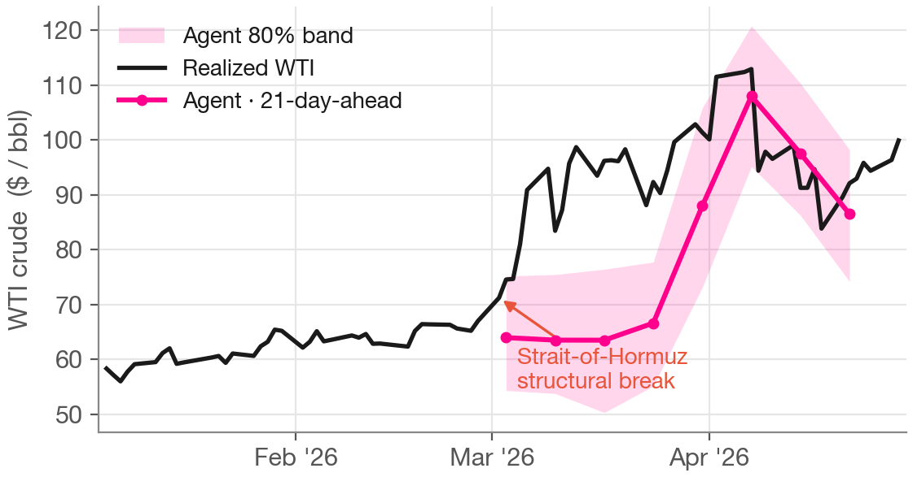
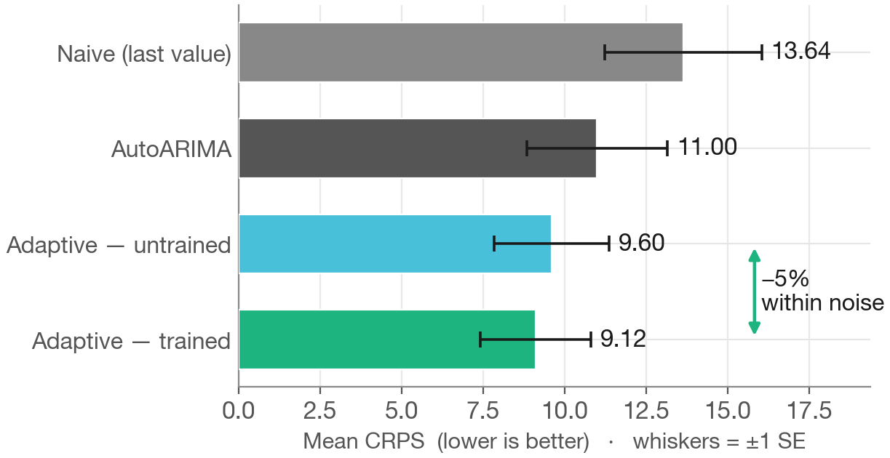

# The Adaptive Agent: evaluate it like an analyst, not a model

**By Ethan Jackson, Behnoosh Zamanlooy, Ali Kore, and Shayaan Mehdi**

Here is a thought experiment we kept coming back to while building this part of the
repo. Suppose you want to know whether an economist is any good, so you ask them to
forecast the economy across 2020 — starting from January, before anyone had heard of
the virus. They can't do it. Not because they lack skill, but because they already know
what happened. Every human alive lived through COVID; you cannot ask one to un-know it
and then grade the "forecast" as if it were made blind. As Ethan put it in the lecture:
"you would never ask a human to backtest economic forecasting over the COVID period, and
then judge them on how accurate they were."

That is exactly the bind we are in with a capable agent. It has a training cutoff, it can
read the news, and — as Post 4 showed — you cannot fence the open web well enough to make
it truly ignorant of the future you're testing on. So the thesis of this post is a
reframe: **we shouldn't evaluate agents like numerical methods; we should evaluate them
like analysts.** A numerical method is defined by its parameters and is honest to
backtest by construction. An analyst is defined by *accumulated experience* — and the
interesting question about an analyst is not "how did you score on a period you already
lived through," but "did working the beat make you better at it?"

This is the natural continuation of the two threads running through the series: the
honest-evaluation discipline from Posts 1 and 4, and — picking up directly from Ali's
Bank-of-Canada session in Post 5 — the move from judging an agent's answer to judging how
it got there. Post 5 evaluated an agent's reasoning from the *outside*. Here the agent
evaluates its *own* track record from the inside, and rewrites its strategy based on what
it finds.

## The one thing that changes

The Adaptive Agent is the Analyst Agent from Post 4 with a single addition. Same identity,
same tools — bounded news search, an E2B code sandbox, statistical skills — same
`Predictor` interface, same output schema. The one new component is a **mutable strategy
held in a skill file** that the agent reads at the start of every forecast and can edit
through a governed set of tools.


*The Day-1 analyst architecture with the strategy state filled in. The dashed
"extensible" box from Post 4 is now solid: a `WtiStrategyState` (serialized to YAML,
rendered to the `SKILL.md` the agent reads) and five typed mutation tools that run in the
host process — not inside the sandbox — so every edit to the strategy is narrow and
auditable.*

The pattern is more common than it sounds. Frontier coding assistants ship with a
skill that lets the agent create and modify its own skills; we've simply built a highly
opinionated version of that, aimed at forecasting. The tagline, in Ethan's words: this is
"a machine that is accumulating experience, and not just making predictions based on
context alone." Two instances of the same agent, run over different histories, become
genuinely different forecasters — because their strategy files diverge.

## A Bayesian update machine

The strategy is not a free-text scratchpad. It is structured into four evidence layers,
and the whole thing behaves like "a kind of Bayesian update machine":

- **Observations** — the cheapest layer. Any pattern that shows up across at least two
  forecasts. Not a single surprise; a single surprise is noise.
- **Hypotheses** — candidate corrections under testing. Opened when observations suggest
  a durable pattern, then tracked with confirmation and refutation counts.
- **Calibration corrections** — the actionable layer. A hypothesis that has earned enough
  confirming evidence graduates into a correction that actually changes behaviour at
  prediction time.
- **Approach narrative** — the highest bar. The overall forecasting philosophy, which
  only changes when the calibration record reveals something structural.

The agent can't touch this file directly. Its only write path is five typed tools —
`record_observation`, `open_hypothesis`, `record_hypothesis_outcome`,
`graduate_hypothesis`, `update_approach_narrative` — each enforcing the bar for its layer.
The governance is bottom-up: you cannot jump to a calibration correction without the
observation and hypothesis record that earns it.

## Hypothesis graduation: why one outlier can't rewrite the strategy

The load-bearing piece is graduation. A hypothesis becomes an active calibration
correction only after it has accumulated enough confirming outcomes — and that check
lives in the harness code wrapped around the agent, not in a prompt asking it nicely to be
careful. Here is the guard, from the tool that promotes a hypothesis:

```python
# graduate_hypothesis — the confirmation threshold is enforced in code
if hyp.confirmations < store.confirmation_threshold:
    shortfall = store.confirmation_threshold - hyp.confirmations
    return (
        f"Cannot graduate {hypothesis_id}: "
        f"{hyp.confirmations} confirmation(s), "
        f"requires {store.confirmation_threshold}. "
        f"Record {shortfall} more confirming outcome(s) first."
    )
```

*From `adaptive_agent/skill_tools.py`. The `confirmation_threshold` (default 3) is a
property of the store, not of the agent's state — the agent cannot lower its own bar. If
the count is short, the tool returns a rejection with the exact shortfall and the agent
has to go accumulate more evidence.*

This is deliberately simple, and deliberately outside the agent's reach. It prevents the
failure mode we worried about most: a single outlier experience overwriting an otherwise
reasonable strategy. It's a first-principles, lightweight version of a discipline the
research literature formalizes fully — Post 7 will pick that up.

## The experiment: study 2025, then face 2026

The experiment is two notebooks, and you can replicate it. **Notebook 05** loads a year of
2025 context — 52 weekly news summaries plus WTI price history — and configures a
blank-slate adaptive agent whose strategy carries only sensible domain priors: no
observations, no hypotheses, no calibrations. Then it hands the agent an open-ended task.
The prompt is close to what Ethan said he'd give a strong model: "go explore, just go
learn what you can, come up with the best robust strategy for forecasting over
backtesting, knowing that I'm going to evaluate you out of sample in the next step." We
don't tell it how many experiments to run or which methods to try — though, as Ethan
noted, an agent is always biased toward the tools you hand it.

The framing matters and is easy to get wrong: this is **curriculum learning**, not online
reinforcement learning. The agent studies historical case files the way a new analyst
would, updates its strategy, and stops. **Notebook 06** then freezes that strategy and
scores it on a protected 2026 window the agent never studied.

That window was brutal. Early 2026 delivered a geopolitical shock in the Strait of Hormuz;
WTI ran from the mid-60s toward triple digits and back within weeks — extreme volatility
and structural regime breaks, about the hardest environment a statistical baseline can
face.



*The protected 2026 evaluation window: WTI's Feb–Mar shock and the agent's weekly
forecasts. This is the out-of-sample period neither the agent nor its curriculum was
designed around.*

## What it learned

So what did a year of self-directed study produce? Mostly one concrete thing — which is
the right outcome for a single curriculum run. The agent ran its own backtests comparing
its linear-trend-projection method against a flat, hold-the-last-price forecast, broken
out by volatility regime and horizon. And it found that in high-volatility conditions,
trend extrapolation falls apart. In the trained strategy's own words: in high-volatility
environments, standard linear trend extrapolation significantly underperforms a flat
trend. The numbers it recorded are stark — at the 21-business-day horizon in the elevated
regime, trend-projection MAE was **11.95** dollars against the flat forecast's **3.91**,
more than triple the error, with a strong negative bias.


*The learned finding, from the agent's own 2025 WTI backtest (real repo data). Trend
projection is only modestly worse than flat-trend in normal volatility, but blows out in
the elevated regime — worst at the longest horizon. The chart keeps the normal-vol bars
in frame rather than cherry-picking the extreme.*

Crucially, the agent did *not* overreact. After one run it opened hypothesis `hyp-001`
recording this pattern, but left the correction below the graduation threshold and the
approach narrative unchanged — exactly what the evidence hierarchy is supposed to enforce.
"It shouldn't fundamentally change the approach after one run," as Ethan put it; "that's
what this whole harness and gating around the agent is supposed to do." It accumulated
information without rewriting itself off a single week.

You can see the shift most directly by diffing the strategy file before and after, and by
asking each version the same question. In the demo, Ethan ran the untrained agent, asked
it to "briefly describe your strategy" and got a generic self-directing answer; then he
swapped in the trained skill — "pull the finished cake out of the oven" — and asked again.
This time it surfaced the active hypothesis about flat-versus-trend under high volatility.


*Placeholder to be captured — see `CAPTURE-LIST.md`. The seed → trained strategy file, showing one curriculum session's worth of disciplined accumulation: observations and one open hypothesis added, approach untouched.*


*Placeholder to be captured — see `CAPTURE-LIST.md`. Untrained vs trained agent answering the same question — the learned hypothesis is visible in the trained agent's own description of itself.*

## The honest result

Did learning make it *better*? Here is where we hold the line the whole series holds. On
the protected 2026 window, mean CRPS went from **9.60** (untrained) to **9.12** (trained)
— about a 5% improvement, lower being better, on the same eval spec introduced in Post 1.



*Untrained vs trained mean CRPS on the protected 2026 window, with ±1 SE whiskers. The
per-origin standard error (~1.7 CRPS) dwarfs the ~0.5 gap between the bars: the change
sits comfortably inside the noise.*

We are not going to inflate this. The gap is real in the sense that we measured it on a
window locked before training — but it is well within a single standard error across the
handful of origins, so it is **a change, not a demonstrated improvement.** Ethan said it
plainly: "a slight improvement, but I would never call this anywhere close to significant
— but it's stable, at least, which is good." Stable is the honest headline. The mechanism
learned something sensible, encoded it under governance, carried it into a live rationale
on a hard out-of-sample window, and did not degrade the forecast. That is worth something.
It is not a claim that the agent got better.

## What we don't have yet

Three gaps are worth naming, because each is a thread into the next post.

First, **no held-out validation gate.** The harness requires a hypothesis to be confirmed
a few times before it changes the strategy — but "confirmed" is checked against the same
study data, never against a held-out slice. We commit updates without ever asking whether
they improve on data the agent didn't already use. And as Ethan warned, "it could be very,
very easy to overfit this agent to the backtest period." A graduation threshold guards
against noise; it does not guarantee generalization.

Second, **no archive.** There is a single mutable skill file, edited in place. If a
curriculum takes a wrong turn and overwrites a good strategy, the earlier version is gone —
information is lost over a long run, and there are no diverse stepping stones to fall back
to or recombine.

Third, **a rigid, hand-coded schema.** The four-layer structure — observations,
hypotheses, calibrations, narrative — is *ours*. The agent works within it well, but it
never got to question whether a different memory structure would serve it better.

Each of these — a held-out gate, an archive of past strategies, a learned rather than
hand-designed schema — is something the self-improvement research literature takes
seriously and formalizes. Next in the series, Post 7 places our adaptive agent in that
lineage — ADAS, the Darwin-Gödel Machine, ALMA, SkillOpt — and makes the case that turning
"change" into "improvement" starts with the one piece we left out: a held-out validation
gate.
