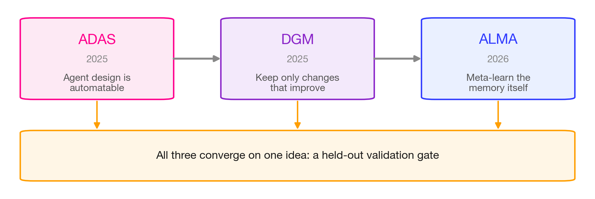
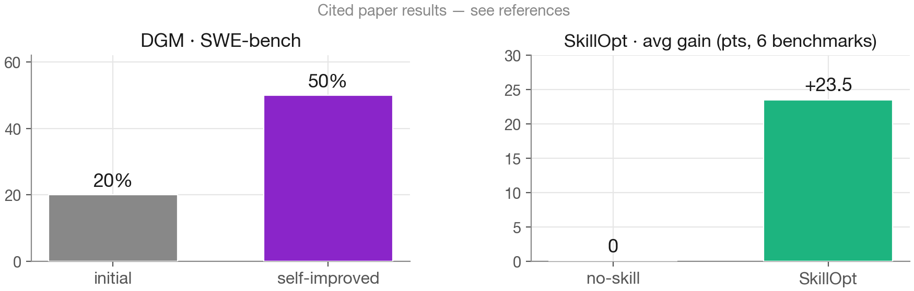
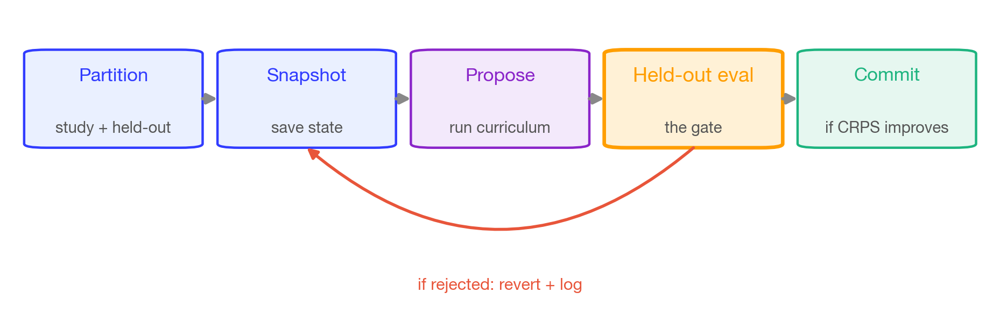
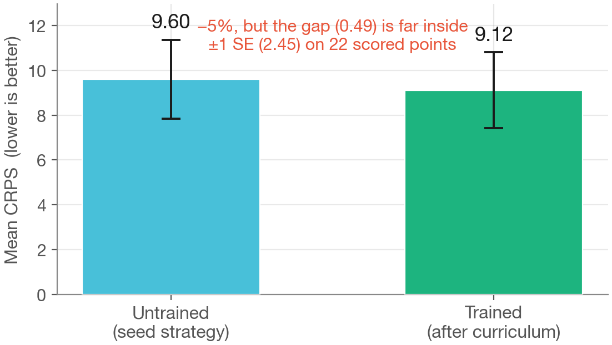

# Self-improving agentic systems: where our adaptive agent sits

**By Ethan Jackson, Behnoosh Zamanlooy, Ali Kore, and Shayaan Mehdi**

In [Post 6](../06-adaptive-agent/post.md) we built an agent that changes its own strategy
from experience, and we were careful about the verdict: its CRPS moved from 9.60 to 9.12
on a protected 2026 window, comfortably inside one standard error. On eight origins, that
is not an improvement we can defend — it is an agent that *changed* and, encouragingly,
did not get worse. The obvious next question is what would turn "changes over time" into
"improves over time." It turns out the research frontier has spent the last two years
answering exactly that, and our small hand-built agent sits recognizably inside its
lineage. This closing post places it there — honestly, including the pieces we didn't
build — and then closes the circle back to where the series opened.

## An arc of papers, from one lab

There is a clean line of work here, and it runs largely through one group. Jeff Clune is
one of the heavy hitters of evolutionary computation; we have followed his lab's work
since its early evolutionary-reinforcement-learning papers, and the recent arc applies
that same evolution-inspired instinct — propose variants, keep what survives — to *agents*
that improve themselves.



*The lineage our adaptive agent sits inside: ADAS (automate the design), the Darwin Gödel
Machine (keep only empirically-better variants, in a diverse archive), and ALMA
(meta-learn the memory design itself). Diagram from our d2-03 lecture.*

**ADAS** — Automated Design of Agentic Systems (Hu, Lu, and Clune,
[arXiv:2408.08435](https://arxiv.org/abs/2408.08435)) — is the premise. A *meta-agent*
writes new agents as code — prompts, tools, control flow — and iterates against a growing
**archive** of designs it has already tried, a procedure they call Meta Agent Search. The
claim that matters for us: agent design is a search problem, and a language model, because
it can generate both text and code, can run that search and discover designs that beat
what humans hand-craft. ADAS is not a held-out-gate method — it is the origin of "automate
the design, don't hand-craft it."

The **Darwin Gödel Machine** (Zhang, Hu, Lu, Lange, and Clune,
[arXiv:2505.22954](https://arxiv.org/abs/2505.22954)) sharpens this into a self-modifying
system: the agent edits its own code, and keeps a variant only when it *empirically*
improves benchmark performance, retaining a population of diverse solutions in an archive
rather than overwriting one current best. The philosophical move is the one to remember.
Schmidhuber's original Gödel machine required a *formal proof* that a self-modification
helps before adopting it; DGM replaces the proof with an **empirical** check on held-out
tasks. On coding benchmarks a single starting agent climbs from **20.0% to 50.0% on
SWE-bench and from 14.2% to 30.7% on Polyglot** — worth stressing that this is the coding
domain, not forecasting, and the paper is careful about the safety framing (sandboxing,
human oversight, reward-hacking risk). Empirical validation in place of proof is the exact
idea a backtest gate would borrow.

**ALMA** — reported as *Learning to Continually Learn via Meta-learning Agentic Memory
Designs* (Xiong, Hu, and Clune, [arXiv:2602.07755](https://arxiv.org/abs/2602.07755)) —
takes the ADAS meta-agent and points it at the one component that governs learning from
experience: **memory**. A frozen model is stateless — nothing persists between calls
unless you build it — so most systems bolt on a hand-designed memory module and freeze it.
ALMA instead searches code-space for the memory *design* itself: the schema, the retrieval
policy, and the update rules, meta-learned from task performance rather than chosen by a
human. This is the destination our adaptive agent gestures at: it *has* a memory, but every
design decision in that memory was made by us in a single sitting. *(We flag two names as
reported pending a PDF check: the "ALMA" acronym and, below, SkillOpt's "GPT-5.5" model
label.)*

## What we hand-designed, and what these methods would search

The useful exercise is to lay our agent's pieces next to what this lineage would instead
*discover*. Every mechanism we shipped in Post 6 is a fixed choice occupying a slot these
methods treat as a search variable.

The clearest example is the memory schema. Our strategy state is a Pydantic type — four
learning layers with escalating evidence bars, which we designed because it made intuitive
sense for a forecasting domain:

```python
class WtiStrategyState(AdaptiveSkillState):
    approach_narrative: str                                # highest evidence bar
    calibration_corrections: list[CalibrationCorrection]   # graduated from hypotheses
    hypotheses: list[Hypothesis]                           # under active testing
    observations: list[Observation]                        # cheapest — any pattern
    version_history: list[VersionEntry]
```

*Excerpt from `implementations/energy_oil_forecasting/adaptive_agent/skill_state.py`.
Standardizing on a typed schema is good practice for agentic search — it gives the search
a common language — but ADAS or ALMA would treat this class as a candidate to be generated
and swapped, not a fixture to write by hand.*

- **The schema** (`observations → hypotheses → calibration_corrections → approach_narrative`):
  we chose four layers. ALMA would search over schemas and might discover a regime-indexed
  or event-tagged structure we would never think to write.
- **Retrieval:** our skill file is loaded into context *in full* on every forecast — there
  is no mechanism to retrieve only the parts that fit the current regime or horizon unless
  we rebuild the system. ALMA would meta-learn that retrieval policy too.
- **Update rules:** we govern updates with a hand-coded harness. Its one gate is a
  confirmation *count* — a hypothesis must be confirmed `confirmation_threshold` times
  before `graduate_hypothesis` promotes it to a calibration correction. That is a real
  accept/reject gate, but it is on the wrong axis: it asks *"have we seen this pattern
  enough times?"* not *"does committing this change improve held-out performance?"* These
  methods would learn the update rules and validate them out-of-sample.

Read down that list and one absence unifies it. DGM keeps a change only if it helps on
held-out tasks; ALMA judges a memory design on temporally-cutoff, out-of-sample
performance. The shared principle across the arc is a **held-out validation gate**, and it
is the one piece our agent does not have. As Ethan put it, improvement really should
require a held-out gate — evidence accumulation alone can't tell a genuine improvement from
a lucky drift.

## Why we ran the simple version: cost

We didn't implement any of these methods, and the honest reason is budget. A single
backtest of the oil-price reference implementation can cost upwards of ~$100 on a mid-tier
model like Gemini 3.5 Flash. An evolutionary search evaluates *many* candidate designs, and
each candidate needs at least one full backtest — often a series of them — to be scored. An
archive of diverse solutions grows quickly, and recombining ideas across it multiplies the
runs. Serious applied research is built on exactly these techniques, but at bootcamp
budgets the full search is out of reach. That constraint is what justifies the simpler
thing we built: a linear search over a hard-coded structure, rather than a search over the
structure itself.

## The tools closest to us: SkillOpt and SIA

Two recent projects sit right beside our design.

**SkillOpt** — *Executive Strategy for Self-Evolving Agent Skills* (Yang et al., Microsoft;
[arXiv:2605.23904](https://arxiv.org/abs/2605.23904), MIT-licensed) — is the tightest,
most defensible analogy to what we built. It treats a natural-language **skill document** as
the trainable external state of a **frozen** model — no weight training, text only. An
optimizer model turns scored rollouts into bounded add/delete/replace edits, and — this is
the crux — **an edit is accepted only if it strictly improves a held-out validation score**,
with rejected edits buffered as negative feedback and a textual "learning-rate" budget for
stability. It deploys a single compact `best_skill.md` with no extra inference calls at run
time. Reported results: best-or-tied on **all 52** (model, benchmark, harness) cells, with
average gains over a *no-skill* baseline on the reported GPT-5.5 setting of **+23.5**
(direct), **+24.8** (Codex), and **+19.1** (Claude Code). Our `wti-strategy` skill file is
exactly this kind of artifact, and our curriculum is a version of this loop — minus the
held-out gate.

**SIA** — *Self-Improving AI with Harness & Weight Updates* (Hebbar et al., Hexo Labs and
Oxford; [arXiv:2605.27276](https://arxiv.org/abs/2605.27276), MIT-licensed) — is the horizon
past text. It runs one loop that jointly optimizes **both** the text harness (prompts,
tools, scaffold) **and** the model weights (via LoRA), driven by a trajectory-reading
feedback agent. Reported: LawBench **+25.1%** over the prior state of the art, a GPU kernel
at **1,017 vs 1,161 μs** (about 12% faster), and single-cell RNA denoising **+20.4%**. Our
agent moves only the text lever; SIA is a reminder that the weights are a mutable knob too.
It also carries the caution most relevant to anything gated on a backtest: the authors warn
of **coupled co-evolutionary Goodhart** — jointly optimizing against one reward can satisfy
the *verifier* without improving the true task, so a fixed point can look strong on the
benchmark and be fragile under distribution shift. Over-optimize a backtest gate and you
overfit the backtest. *(The SIA arXiv ID is worth an expert confirm; it is now listed in
our `SOURCES.md`.)*



*Headline deltas from the cited work — DGM's 20%→50% SWE-bench climb and SkillOpt's +23.5
average gain — as reported in the respective papers (coding and general-agent benchmarks,
not forecasting). Sources linked inline above.*

## The one thing to build: a held-out gate

For anyone continuing the self-improving track in the build phase, the tractable move is
not to reimplement an evolutionary search — it is to borrow the single principle these
papers share and wire it into the harness we already have. Rather than *instructing* the
agent to run a backtest, make the harness itself require one before any strategy change is
committed.



*The held-out validation-gate loop we'd add to the curriculum. It is deliberately small —
a wrapper around the mutation tools, using the `evaluate()` harness that already exists.*

Concretely: partition 2025 into a study window and a held-out validation window; snapshot
the strategy before any mutation; let the agent propose an update through its usual tools;
then rerun `evaluate()` on the held-out window with the *candidate* strategy and commit the
change only if CRPS improves — otherwise revert and log the failed edit as negative
feedback. That single addition is what would let us score a *gated* trained agent against
the *ungated* one on the protected 2026 window, and finally say whether the gate turns
change into improvement.



*Our own result, honestly: CRPS 9.60 → 9.12 on the protected 2026 window, within ±1 SE.
Real backtest from the energy-oil reference implementation. A held-out gate is precisely
the machinery that would let a future version claim more than "did not get worse."*

## Full circle: two testbeds for each other

Which brings us back to where the series started. Self-improvement research and *living*
forecasting challenges turn out to be testbeds for one another — complementary, not the
same thing. Self-improvement supplies the machinery: a mutable strategy plus a held-out
gate that decides whether a change earns its place. A living benchmark like
[ForecastBench](https://www.forecastbench.org/explore/) supplies the yardstick: ~1,000
regularly-refreshed questions about future events with *no known answer at submission*,
which makes it structurally leakage-proof and non-stationary. That is exactly the setting
in which you can honestly test whether a backtest-gated agent *generalizes* or merely
overfit its gate — the Goodhart failure SIA warns about. The two halves are complementary:
ForecastBench is a scoreboard, not an optimization loop; the self-improvement machinery is
a loop that needs an honest scoreboard to be worth anything. Each makes the other testable.

It is worth keeping the scoreboard's own verdict in view. On a 200-question subset,
ForecastBench found that expert human superforecasters still beat the top language model
(p < 0.001). The models are climbing — that was the chart that opened Post 0 — but they
have not passed the humans, and a living benchmark is how we'll know honestly when, or if,
they do.

## Stay tuned

That is the series. We started with a single question — *can agents forecast, measured
honestly?* — and spent eight posts building the discipline to answer it without fooling
ourselves: a shared interface, proper scoring rules, strict cutoffs, protected evals,
reasoning judged and not just answers, and an adaptive agent reported with its uncertainty
intact. The honest destination, the one we kept pointing at, is **live evaluation of
in-production forecasting agents** — scored on futures that genuinely haven't happened yet.
Two directions we're especially interested in exploring: agents that **learn from
experience over time** — the adaptive thread of Post 6, now with a real held-out gate — and
agents that are themselves **ensembles of diverse expert forecasters**, the blending
Behnoosh flagged back in [Post 2](../02-conventional-methods-sp500/post.md) as something
LLMs might do well. No promises, just the map of where we think this goes.

Thank you for reading. If you want the one image that frames all of it, go back to the
chart that opened [Post 0](../00-intro/post.md): language models climbing, year over year,
toward the superforecaster line — with the humans still ahead, and the future doing what it
always does, which is refusing to be memorized. That is the scoreboard. It is honest
because it hasn't happened yet, and that is the whole reason forecasting is such a good
place to find out what agents can really do.
